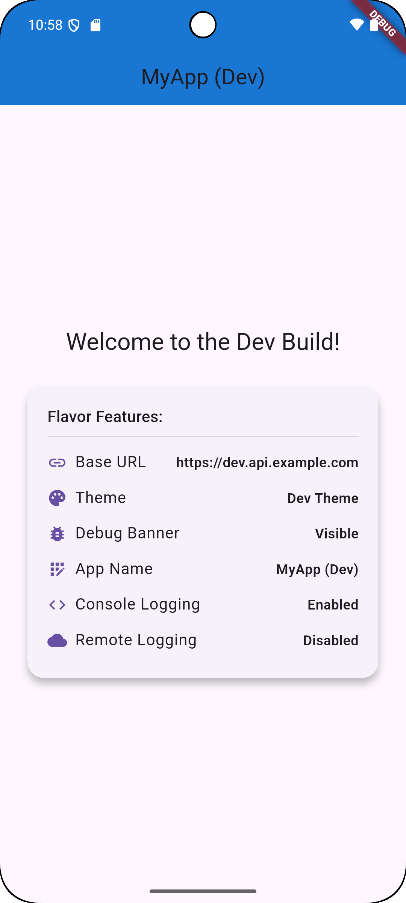
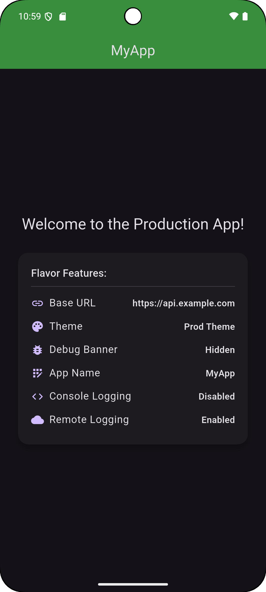

# Flutter Flavor Demo

### Simple Flavor-Based Environment Setup in Flutter

This is a minimal Flutter app that demonstrates how to set up and use Flutter flavors. It showcases how a single codebase can behave differently across development and production environments using simple configuration.


## Features

- Flavor-based setup (dev and prod)
- Different app names, themes, and welcome messages per flavor
- Displays environment-specific Base URL
- Console logging in dev, remote logging in prod
- Separate entry points for each flavor

</br>

## Showcase

<table>
  <tr>
    <td>Dev</td>
    <td>Prod</td>

  </tr>

  <tr>
    <td></td>
    <td></td>
  </tr>
 </table>
<br/>

### Run the App
Use the following commands to run each flavor:
```
flutter run -t lib/main_dev.dart --flavor dev
flutter run -t lib/main_prod.dart --flavor prod
```
Or create separate run configurations in your IDE by selecting the appropriate entry point and passing the build flavor in arguments.

</br>

### What Else Can You Do with Flavors?
- Use different app icons and display names
- Configure per-environment Firebase projects
- Manage API keys or credentials separately
- Toggle features or enable A/B testing
- Use separate bundle IDs or application IDs for installation

If you found this useful, feel free to follow me on [LinkedIn](https://www.linkedin.com/in/alxayeed/) or [Medium](https://alxayeed.medium.com/) to get more Flutter tips and project walkthroughs like this!

